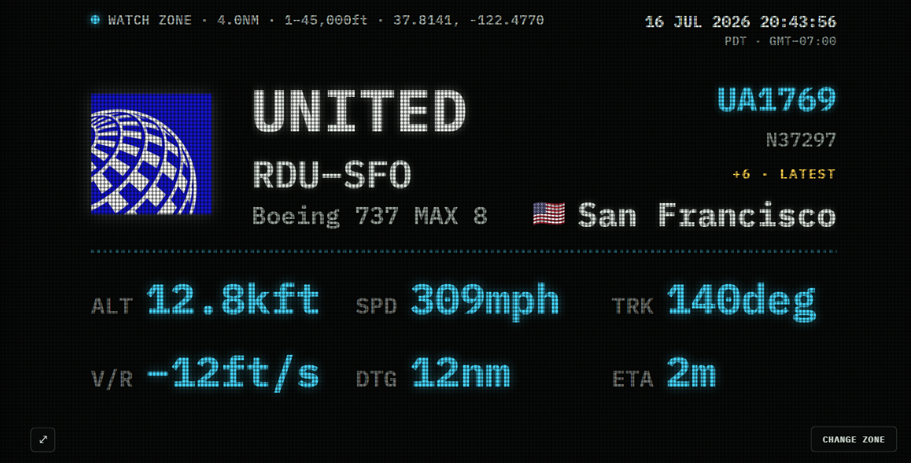

# SkyPane
[](https://github.com/wilomocha/SkyPane/actions/workflows/docker.yml)
[](https://github.com/wilomocha/SkyPane/releases)
[](LICENSE)
[](https://nodejs.org)

**A live flight-watch display for any pane** — your laptop, a spare monitor, a tablet
propped on a shelf, a TV, whatever screen you already own. No dedicated hardware required.

SkyPane watches a small patch of sky you define and shows the **one aircraft currently
inside it** on a retro LED dot-matrix "airport board": airline, route, aircraft type,
destination, and live altitude / speed / track / vertical-rate / distance-to-go / ETA.



---

## Why I built this

My office overlooks the airspace above the Golden Gate Bridge, and I was constantly
curious about what was flying overhead. There are great dedicated hardware solutions for
this — SkyPane was inspired by [AxisNimble's **TheFlightWall_OSS**](https://github.com/AxisNimble/TheFlightWall_OSS),
an open-source LED-panel build that does exactly this on physical hardware. I wanted the
same idea, but without putting an expensive piece of dedicated hardware on my desk.
SkyPane is a software-only take on it: point any browser at it and any screen becomes the
board.

---

## Features

- **Runs on any screen.** It's a web page — open it on a laptop, tablet, TV browser, or a
  Raspberry Pi kiosk. Auto-scales to fill horizontal displays.
- **Single-aircraft watch zone.** Define a small area (lat/lon + radius) with an altitude
  bracket so exactly one aircraft is in view at a time; if more than one is present it
  shows the most recent arrival and flags `+N · LATEST`.
- **Map-based zone picker.** Click or drag a map (Leaflet + OpenStreetMap) to place the
  zone and set the radius — or type exact coordinates.
- **Live ADS-B with automatic failover.** Positions come from **adsb.lol → adsb.fi →
  airplanes.live**; on a rate-limit (HTTP 429) it fails over to the next source, cools the
  throttled one down, and shows an on-screen `SRC …` badge while a fallback is active.
- **Layered route resolution.** Airline + origin/destination come from
  **vrs-standing-data → adsbdb → airframes.io → FlightAware AeroAPI → your own CSV**, and
  every candidate is sanity-checked against the plane's live position, so a stale/wrong
  route is suppressed rather than shown incorrectly.
- **Real aircraft-type names.** ICAO designators are expanded (`B38M` → *Boeing 737 MAX 8*)
  from the bundled ICAO Doc 8643 list.
- **Realistic ETA.** Remaining flight time is estimated against a representative cruise
  speed for the type (not the plane's momentary climb/descent speed).
- **Airline logos.** Drop your own logo files in `public/logos/` and they replace the
  generic globe (LED-masked to match the board).
- **Fit-then-scroll text.** Long airline names / destinations shrink to fit, and only
  scroll (marquee) if they still don't — no truncation.
- **Kiosk-friendly.** Screen Wake Lock (won't sleep), fullscreen toggle (`F`), and
  controls that auto-hide after 5s of no mouse movement.
- **Live push updates.** A WebSocket pushes changes the instant they happen — including
  the moment a new aircraft enters the zone.
- **Per-viewer zones.** Each browser keeps its own zone/display settings; viewers sharing
  a zone share one polling loop on the server (no extra API load).
- **Self-contained.** No build step, no framework, no API key required to get started.

---

## How it works

```
 Browser (any screen)                         SkyPane server (Node)
 ┌───────────────────────┐   WebSocket   ┌────────────────────────────────┐
 │ LED dot-matrix board  │◀─ updates ────│ per-zone poll loop             │
 │ + map zone picker     │── set zone ──▶│  ├─ ADS-B positions            │
 └───────────────────────┘               │  │   adsb.lol→adsb.fi→a.live   │
                                         │  ├─ pick single aircraft in    │
                                         │  │   zone (latest entrant)     │
                                         │  └─ enrich: route/airline/type │
                                         │      vrs→adsbdb→airframes→      │
                                         │      AeroAPI→CSV (+ logos)      │
                                         └────────────────────────────────┘
```

1. In the browser you pick a **watch zone** — a coordinate, a radius, and an altitude
   floor/ceiling. The browser sends it to the server over a WebSocket.
2. The server runs **one polling loop per unique zone** (shared by everyone watching it).
   Each tick it fetches aircraft near the point, filters to your radius + altitude bracket,
   and selects the **single** aircraft to show (most recent entrant when several qualify).
3. That aircraft is **enriched**: route + airline from the route sources (each validated
   against the live position), a full aircraft-type name, an airline logo if you've added
   one, and computed distance-to-go / ETA.
4. The server **pushes** the result to every subscribed browser whenever anything changes,
   so a new plane appears the moment it enters the zone. The browser renders the board.

Positions refresh every `ADSB_POLL_MS` (default 10s); route/airline/type lookups are
cached (~6h per callsign), so the paid/last-resort sources are rarely hit.

---

## Tech stack

- **Data sources:**
  - ADS-B positions — [adsb.lol](https://adsb.lol/), [adsb.fi](https://adsb.fi/),
    [airplanes.live](https://airplanes.live/) (free, ADSBExchange-v2-compatible; data ODbL).
  - Routes / airlines / airports —
    [adsb.lol vrs-standing-data](https://github.com/adsblol/vrs-standing-data),
    [adsbdb.com](https://www.adsbdb.com/), and optionally
    [airframes.io](https://airframes.io/) and
    [FlightAware AeroAPI](https://www.flightaware.com/commercial/aeroapi/) (keys required).
  - Aircraft types — bundled ICAO Doc 8643 designator list.
- **Backend:** Node.js (≥18), [Express](https://expressjs.com/) for static serving and
  [`ws`](https://github.com/websockets/ws) for the live WebSocket. Uses the built-in
  `fetch` — no HTTP-client dependency.
- **Frontend / display:** plain HTML/CSS/JavaScript — no framework, no build step. The
  zone-picker map uses [Leaflet](https://leafletjs.com/) (bundled locally). Any modern
  browser; designed for horizontal/landscape screens.
- **Hosting options:** run it as a plain Node process (with a systemd unit), in Docker /
  docker-compose, or on any small always-on box (a Raspberry Pi is plenty). Put it behind
  nginx/Caddy for TLS if you expose it. It's a single lightweight process.

---

## Getting started

Requires **Node.js 18 or newer** ([nodejs.org](https://nodejs.org) — the LTS build).

### Windows

1. Install Node.js (LTS) from [nodejs.org](https://nodejs.org).
2. Open **PowerShell** in the project folder and run:
   ```powershell
   npm install
   npm start
   ```
3. Open <http://localhost:3000>.

To set an option (e.g. an API key) for one run:
```powershell
$env:AEROAPI_KEY="your-key"; npm start
```

### Linux

```bash
# install Node 18+ first (distro package, nvm, or nodesource), then:
npm install
npm start
# open http://localhost:3000
```

Set options inline as needed:
```bash
AEROAPI_KEY=your-key npm start
```

For an always-on install, use the systemd unit in [Configuration](#running-as-a-service).

### Docker

```bash
docker compose up -d --build
# open http://<server>:3000
```

or without compose:
```bash
docker build -t skypane .
docker run -d --name skypane -p 3000:3000 --restart unless-stopped skypane
```

or via GitHub's Docker registry (ghcr.io):
```bash
docker pull ghcr.io/wilomocha/skypane:latest
```
---

## Configuration

### How to configure the watch zone

The watch zone is set in the UI — no config files needed:

1. Click **CHANGE ZONE** (bottom-right of the board).
2. On the map, **click or drag** to place the zone's center (or type exact **LAT/LON**).
3. Use the **radius** slider to size the zone (a small radius keeps one aircraft in view).
4. Set the **altitude floor/ceiling** to bracket the traffic you care about (e.g. only
   low, arriving/departing aircraft).
5. Optionally set **accent color**, **units** (imperial/metric), and **screen effects**.
6. Click **APPLY**.

Settings are saved **per browser** (localStorage), so each screen can watch a different
zone. The default zone is 2 NM around **37.818858, -122.478997** (over the Golden Gate);
for busier skies try coordinates near a major airport with a slightly larger radius.

### Server options (environment variables)

Everything else is optional environment variables — copy [`.env.example`](.env.example) to
`.env` and edit, then start with `node --env-file=.env server.js` (Node 20+) or pass them
inline. Highlights:

| Variable | Default | Purpose |
| --- | --- | --- |
| `PORT` | `3000` | HTTP/WebSocket port |
| `ADSB_POLL_MS` | `10000` | Poll interval per zone (ms). Lower = more live, higher 429 risk. |
| `ADSB_USER_AGENT` | `SkyPane/1.0 …` | Identify yourself to the ADS-B feeds. |
| `AIRFRAMES_API_KEY` | _(empty)_ | Enables the airframes.io backup route source. |
| `AEROAPI_KEY` | _(empty)_ | Enables the FlightAware AeroAPI last-resort route source (paid). |
| `ROUTES_CSV_PATH` / `ROUTE_CSV_OVERRIDE` | `data/routes.csv` / `false` | Your own route corrections. |
| `AIRLINE_LOGO_URL_TEMPLATE` | _(empty)_ | Fallback remote logo URL with {icao} / {name} placeholders, used when no local public/logos/ file matches (e.g. https://logos.example.com/{icao}.png). Loaded by the viewer's browser; local files win. |
| `LOGO_RESCAN_MS / ROUTES_CSV_RESCAN_MS` | `30000` | How often (ms) logos / route CSV are re-scanned for changes; 0 disables. |

**API keys** live server-side only (never sent to the browser). See
[`.env.example`](.env.example) for the full list and base-URL overrides,
[`data/README.md`](data/README.md) for CSV route corrections, and
[`public/logos/README.md`](public/logos/README.md) for adding airline logos.

### Running as a service

`/etc/systemd/system/skypane.service`:

```ini
[Unit]
Description=SkyPane flight-watch board
After=network-online.target
Wants=network-online.target

[Service]
Type=simple
WorkingDirectory=/opt/skypane
ExecStart=/usr/bin/node server.js
Environment=PORT=3000
Restart=on-failure
User=skypane
NoNewPrivileges=true

[Install]
WantedBy=multi-user.target
```

```bash
sudo systemctl daemon-reload
sudo systemctl enable --now skypane
```

If you put it behind a reverse proxy, make sure it forwards WebSocket upgrades for `/ws`.

---

## Acknowledgments

SkyPane was directly inspired by [AxisNimble's TheFlightWall_OSS](https://github.com/AxisNimble/TheFlightWall_OSS)
— thank you for open-sourcing the idea and the build.

This project also only exists because of the broader open-source aviation and ADS-B
tracking community — the people who build and maintain the decoders, feeders, and open data
infrastructure that make hobbyist flight tracking possible at all. Huge thanks to that
community, and to [adsb.lol](https://adsb.lol/), [adsb.fi](https://adsb.fi/),
[airplanes.live](https://airplanes.live/), [adsbdb](https://www.adsbdb.com/), and the
[VirtualRadarServer standing data](https://github.com/vradarserver/standing-data) project
whose data SkyPane displays. Map tiles © [OpenStreetMap](https://www.openstreetmap.org/copyright)
contributors; mapping by [Leaflet](https://leafletjs.com/).

---

## License

[MIT](LICENSE). SkyPane bundles Leaflet, distributed under its own BSD-2-Clause license
(retained in `public/vendor/leaflet/leaflet.js`).
